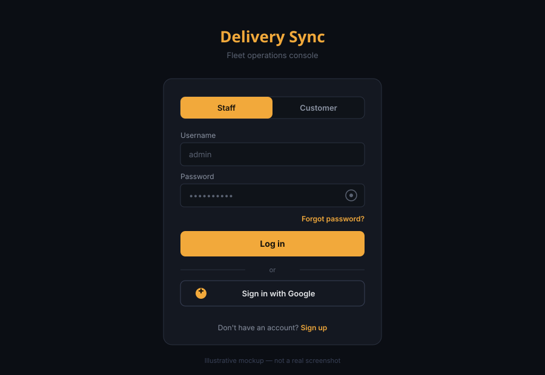
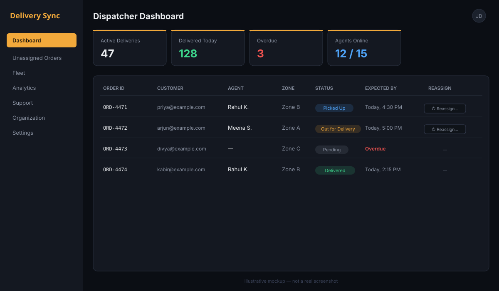
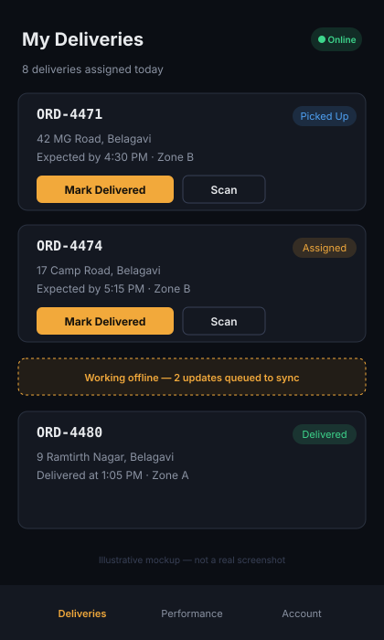
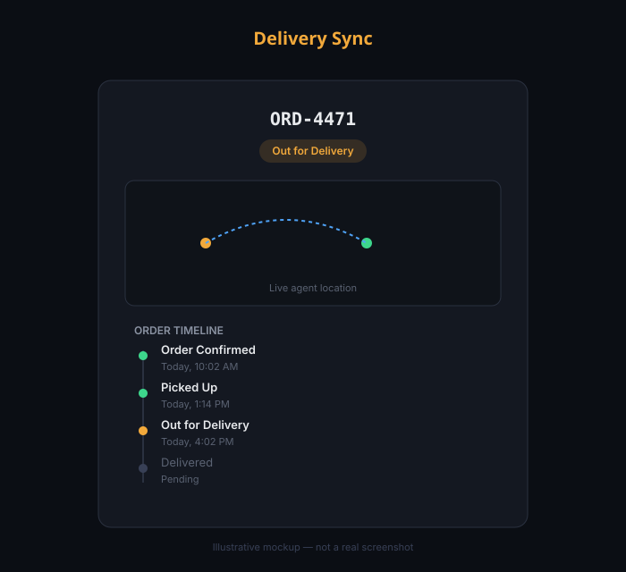

# Delivery Sync


A complete, multi-tenant delivery tracking platform: offline-first status
updates for delivery agents, a full dispatcher/admin operations console,
and a genuine customer-facing portal — order tracking, live notifications,
and feedback, with no backend or terminal access required to use it.

> **Fastest way to actually see it**: run the app locally (see
> [How to Run Locally](#how-to-run-locally) below) and click **"Try the
> Demo"** on the login page — no signup, no credentials, straight into a
> real dispatcher account with two weeks of realistic sample deliveries
> already populated. See [Key Features](#key-features) for what that
> button actually does.

> The badges above reflect a real, locally-verified run of this exact
> codebase (`pytest -v --cov=app`, `npm run build`) — not live CI status
> (see [Continuous Integration](#continuous-integration) below for the
> actual workflow that reproduces these numbers on every push).

## What This Actually Is

This started as an offline-sync exercise and grew into a full logistics
platform with three separate, real user experiences:

1. **Agents** — update delivery status (works fully offline, syncs when
   back online), scan packages, see their route, message dispatch.
2. **Dispatchers / Admins** — assign, reassign, or return-to-pool any
   delivery (single-row or bulk CSV import), track everything on a live
   dashboard, manage their organization's users, export data, message
   agents.
3. **Customers** — sign up (with email/password OR Google), see every
   order linked to their account (across any organization using this
   platform), get real in-app notifications the moment a status changes,
   view proof of delivery, and leave a rating — all inside the product
   itself.

Multi-tenant from the ground up: any number of separate delivery
companies ("organizations") can use the same running instance without
ever seeing each other's data.

## How to Access Each Portal

There is **one single login page** for everyone — an **"Account Type"**
dropdown at the top of both the Login and Signup forms switches between
**Staff (Agent / Dispatcher / Admin)** and **Customer**, which swaps the
form fields (username vs. email) and which account actually gets created
or logged into. Both account types can also sign in with **Google**
directly from that same page — see [Key Features](#key-features).

- **Staff or customer, login or signup:** just open the app — you land
  directly on the login page, pick your account type from the dropdown,
  and go.
- **Instant demo, no account at all:** click **"Try the Demo"** at the
  top of the login page — logs straight into a real, pre-populated
  dispatcher account.
- **Public order tracking (no account at all):** `?track=<delivery-id>` —
  shareable with anyone, works with zero login.
- Staff and customer sessions are stored completely separately in the
  browser. If both happen to be logged in at once (e.g. you tested both),
  the staff session takes priority on load — log out of staff to drop
  back to the login page and access the customer account instead.

## How to Run Locally

Two servers, two terminals — both must run at the same time.

**Backend:**
```bash
cd backend
pip install -r requirements.txt
uvicorn main:app --reload
```
Runs at `http://127.0.0.1:8000` — visit `/docs` for the interactive API
reference.

**Frontend** (separate terminal):
```bash
cd frontend
npm install
npm run dev
```
Runs at `http://localhost:3000`.

> **If you're pulling a fresh copy of this project after previously
> running an older version:** delete `backend/database.db` before
> starting the backend. The schema has grown a lot across development
> (organizations, customers, notifications, OAuth accounts, and more)
> and an old database file predates those tables.

Prefer a single command, or want the "real deployment shape" (Postgres
instead of SQLite, the frontend served as static files behind nginx,
`ENVIRONMENT=production` locked down)?
```bash
docker compose up --build
```
then visit `http://localhost:3000` — see `docker-compose.yml`'s own
comments for exactly what changes in production mode.

## Deploying It For Real

Want this actually **live** at a URL, not just running on your machine?
This repo includes a [`render.yaml`](render.yaml) Blueprint —
[Render](https://render.com)'s free tier will run the backend API, the
frontend, and a managed Postgres database from one file:

1. Push this repo to your own GitHub account.
2. On [render.com](https://render.com): **New → Blueprint**, point it at
   your fork. Render reads `render.yaml` and provisions all three
   services automatically.
3. After the first deploy, copy the backend's real `.onrender.com` URL
   into the frontend service's `VITE_API_BASE_URL` build arg (Environment
   tab → rebuild), and the frontend's real URL into the backend's
   `ALLOWED_ORIGINS`/`FRONTEND_URL` (Environment tab → the backend
   restarts on its own, no rebuild needed for those two). This two-step
   "deploy once, then wire the two real URLs together" dance is
   unavoidable — each service's real address only exists after its own
   first deploy — `render.yaml` has a comment at each spot that needs it.
4. *(Optional)* Add real credentials for SMTP, Twilio, Razorpay, Google
   OAuth, or push notifications in the backend service's Environment
   tab — every one of these already works with zero config (console-
   logged / honestly disabled instead), so this step turns features on,
   it doesn't unblock a broken deploy.

**Free-tier honesty:** Render's free web services spin down after 15
minutes idle and take ~30–60s to wake back up on the next request — fine
for a portfolio piece someone clicks into occasionally, not an always-on
demo. The free Postgres instance also expires after 90 days. Both are
Render platform limits stated plainly here rather than glossed over.

**Railway or Fly.io instead?** Both platforms auto-detect the
`Dockerfile` already in `backend/` and `frontend/` with no extra config
file needed — `railway up` (after `railway init`) or `fly launch` from
each folder gets you most of the way there; you'll still need to set the
same environment variables `render.yaml` lists (`DATABASE_URL`,
`JWT_SECRET_KEY`, `ALLOWED_ORIGINS`, `FRONTEND_URL`,
`VITE_API_BASE_URL`) through that platform's own dashboard/CLI instead.

## Continuous Integration

[`.github/workflows/ci.yml`](.github/workflows/ci.yml) runs on every push
and pull request once this repo is on GitHub: the full backend test suite
with a coverage report, the frontend unit test suite followed by a
production build, a Docker image build check for both services, and a
config/dependency check for the mobile app — four independent jobs, so a
frontend-only change doesn't wait on the (slower) backend suite. Coverage
is uploaded as a downloadable build artifact on every run rather than a
separate paid coverage service.

## Running the Test Suite

**Backend:**
```bash
cd backend
pip install -r requirements.txt
pytest -v
```

**447 tests** across 40 test files, covering staff auth (password + Google
OAuth), customer auth (password + Google OAuth), the public tracking
page, dispatcher operations (assign/reassign/return-to-pool/bulk
actions), fleet, finance, support, RBAC, security (login history,
lockout, 2FA, session management), monitoring, automated + manual
backups, the demo sandbox, push notifications (Web Push + Expo push),
and every other Phase in `docs/FEATURE_LOG.md`
— **82% statement coverage** across the whole backend (`pytest --cov=app
--cov-report=term-missing`, see exact per-file numbers in that output).
Each test runs against its own isolated temp SQLite database, never the
real `database.db`.

> The suite currently needs to be run in a few smaller batches on some
> constrained CI-like environments, purely due to wall-clock time limits
> on a single command — `.github/workflows/ci.yml` runs it as one
> `pytest -v` invocation with no such limit, so this doesn't affect a
> real CI run or local development at all.

**Frontend:**
```bash
cd frontend
npm install
npm test
```

**69 tests** across 7 files (Vitest + React Testing Library) — a real
start, stated honestly as exactly that rather than inflated: full
coverage on the specific files tested (the hand-rolled CSV parser used
for bulk import, the zone-grouping/nearest-neighbor route optimizer, the
offline sync engine's retry logic and conflict-description formatting,
and a handful of components including the full `LoginPage` form/2FA/
demo-login flow), but most of the ~63 other components have no tests yet
— this is a foundation to build on, not comprehensive frontend coverage
the way the backend's 82% is. `npm run test:coverage` generates the full
per-file breakdown.

## Product Tour

> These are hand-built mockups illustrating each portal's layout and
> flow, **not real screenshots** of the running app — this environment
> has no way to render a live browser session to capture actual ones.
> Everything they depict (the reassign dropdown, the offline sync
> banner, the live timeline) is a real, working feature — run the app
> yourself (see [How to Run Locally](#how-to-run-locally)) to see the
> genuine UI.

**Login — one page, two account types, Google or password**


**Dispatcher dashboard — live stats, per-row reassign/return-to-pool**


**Agent app — works offline, syncs when back online**


**Public tracking — no login required, live status timeline**


## Getting Started — A Full Walkthrough

1. Open the app, choose **Staff Login**, sign up (email/password, or
   **Sign up with Google**). The first person to sign up for a new
   company **creates an organization** and automatically becomes its
   **admin** — this generates an invite code.
2. Sign up a second staff account, this time **joining** that
   organization with the invite code, as an **agent**.
3. As the admin/dispatcher, go to the **Dashboard** and assign a
   delivery to that agent — optionally fill in a customer email so it
   links to a real customer account later.
4. Open a separate tab/session, choose **Track My Orders (Customer)**,
   sign up using the *same* email you entered above — the order
   auto-links to their account immediately (even retroactively, if they
   sign up after the order already existed, and works the same way for
   a Google sign-up too).
5. As the agent, update the delivery's status — watch the customer's
   dashboard pick up a live in-app notification.
6. Back as the dispatcher, try **reassigning** that delivery to a
   different agent from the table (or the delivery detail modal), or
   **returning it to the unassigned pool** if it's still just-assigned.
7. Mark it **Delivered** (capturing a signature or photo) — the customer
   can now leave a star rating, right in their dashboard.

## Native Mobile App

Beyond the responsive/PWA web app, `mobile/` is a real React Native
(Expo) app for delivery agents — built as a second, independent client
of the same backend API, with **genuine OS-level background GPS
tracking** (a real foreground service on Android, "Always" location
permission on iOS) that keeps a customer's live tracking map updating
while an agent's phone is locked in a cupholder. This is a real,
substantive gap the web app's PWA/browser-based location sharing
cannot close — every mobile browser stops firing location updates the
moment a tab is backgrounded, a platform-level restriction, not
something fixable with more web code. It also now has a genuine
**offline queue** (AsyncStorage-backed, syncing through the same
`POST /sync` endpoint the web app's own offline mode already uses) —
an agent can advance a delivery's status with no signal at all, and it
syncs automatically the moment connectivity returns, with 22 tests
covering the retry/backoff and sync-trigger logic. And **real push
notifications** via Expo's push service — an agent gets notified of a
new/removed assignment even with the app fully closed, sent from the
exact same backend fan-out function that already sends the web app's
Web Push for the same events. See
[`mobile/README.md`](mobile/README.md) for the full explanation, setup
instructions, and an honest list of what this app does and doesn't
(yet) do relative to the full web agent app.

## Key Features

- **"Try the Demo" one-click sandbox** — no signup, no credentials;
  logs straight into a real, pre-populated dispatcher account with two
  weeks of realistic sample deliveries, a full fleet, and a live SLA
  policy already in place — a shared demo org, reset back to this same
  state automatically every few hours
- **Offline-first agent app** — IndexedDB-backed local storage with a
  conflict-resolving sync engine; works with zero connectivity
- **Multi-tenant** — organizations, invite-code onboarding, full data
  isolation, verified with real cross-org isolation tests
- **Google OAuth/SSO** — for both staff and customer accounts, alongside
  ordinary email/password (with a self-service "add a password" fallback
  for an OAuth-only account)
- **Automated database backups** — real SQLite file copy or `pg_dump`
  against Postgres, on a schedule with retention pruning, plus a manual
  "back up now" from the admin dashboard
- **Admin panel** — manage staff accounts, deactivate/reactivate, reset
  passwords
- **Real customer accounts** — not just a tracking link: full dashboard,
  in-app notifications, order history, feedback
- **Route optimization** — zone grouping + nearest-neighbor ordering
  (no paid maps API)
- **Bulk CSV import** — with per-row validation and clear error reporting
- **Dispatcher reassign / return-to-pool** — per-row or in the delivery
  detail modal, with the affected agent notified either way
- **Proof of delivery** — signature capture or photo, required to mark
  Delivered
- **Barcode/QR scanning** — native browser API, no extra libraries
- **Dispatcher ↔ agent messaging** — per-delivery chat thread
- **CSV export**, **rate limiting**, **PWA support**, **light/dark theme**,
  **code-split frontend bundle** (React.lazy on every admin page — main
  bundle is 272KB, not 730KB)

## Tech Stack

| Layer | Technology |
|---|---|
| Frontend | React + Vite (code-split, PWA) |
| Mobile | React Native (Expo) — see `mobile/` |
| Offline Storage | IndexedDB (per-user scoped, web) |
| Backend | FastAPI |
| Database | SQLite (dev/default) or PostgreSQL (production) |
| Auth | JWT + Google OAuth 2.0, separate token types for staff vs. customers |
| Rate Limiting | slowapi (in-memory, Redis-ready) |
| Testing | pytest + pytest-cov (backend), Vitest + React Testing Library (frontend) |
| CI/CD | GitHub Actions (tests + coverage, frontend build, Docker build check) |
| Deployment | Docker Compose (local) or Render Blueprint (hosted) |

## Full Documentation

The `docs/` folder is more thorough than most student projects
intentionally:
- [`TECHNICAL_ARCHITECTURE.md`](docs/TECHNICAL_ARCHITECTURE.md) — architecture and data model
- [`SECURITY_AND_ACCESS.md`](docs/SECURITY_AND_ACCESS.md) — auth model, known limitations
- [`FEATURE_LOG.md`](docs/FEATURE_LOG.md) — every feature: what was missing, why it was built, what it does
- [`PROJECT_WORKFLOW.md`](docs/PROJECT_WORKFLOW.md) — every real bug hit during development and how it was diagnosed/fixed
- [`DISASTER_RECOVERY.md`](docs/DISASTER_RECOVERY.md) — backup/restore procedures for both SQLite and Postgres
- [`PROJECT_REQUIREMENTS.md`](docs/PROJECT_REQUIREMENTS.md) — requirements
- [`FEATURE_TICKET_LIST.md`](docs/FEATURE_TICKET_LIST.md) — feature tracking by phase

## Known, Disclosed Limitations

- Password reset is admin-set for staff without SMTP configured (console-
  logged instead by default; real SMTP works via env vars)
- Email/SMS notifications default to console-log; real delivery needs
  SMTP/Twilio credentials via environment variables
- Rate limiter is in-memory by default; set `REDIS_URL` for a real
  multi-server deployment
- Barcode/QR scanning uses the browser's native `BarcodeDetector` API,
  currently Chrome/Edge only (not Firefox/Safari)
- An OAuth-only account (no password ever set) has no login fallback if
  Google sign-in itself is unreachable — see the "Set a Password" option
  in Account Settings
- Automated backups live on the same disk as the database they back up —
  no offsite/geo-redundant copy; see `docs/DISASTER_RECOVERY.md`
- The mobile app (`mobile/`) now has a real offline queue (see its
  README's "Offline Support" section) and real push notifications
  (requires a one-time `npx eas init` and a physical device — see its
  README's "Push Notifications" section) and is login-only (create the
  agent account on the web app first); no compiled `.apk`/`.ipa` was
  produced — this sandbox has no Xcode/Android Studio/device to build
  or test one on; see `mobile/README.md`'s "Not Yet Built" section for
  the remaining honest list (proof-of-delivery capture, barcode
  scanning, messaging)
- Frontend test coverage is a real start (69 tests), not comprehensive —
  4 of ~19 service files and 4 of ~63 components are actually tested;
  writing those tests found and fixed one real accessibility bug
  (`LoginPage.jsx`'s labels weren't programmatically linked to their
  inputs), which is a reasonable signal the same pattern likely recurs
  elsewhere — a full accessibility audit across the frontend hasn't been
  done; see `docs/PROJECT_WORKFLOW.md`'s entry on how this was found
- The demo (`POST /auth/demo-login`) is one SHARED sandbox organization,
  not a private one per visitor — every concurrent demo user sees (and
  can edit) the same data, reset back to its known-good seeded state
  automatically every few hours (`DEMO_RESET_INTERVAL_HOURS`); it also
  only seeds the delivery-operations side of the product (staff, zones,
  fleet, deliveries, SLA) — the e-commerce/marketplace/invoicing
  subsystems aren't pre-populated with sample data, see
  `services/demo_seed.py`'s own module docstring for the full scope

## Author

Built by Santy as a portfolio project targeting Python Full Stack,
Software Developer, and Backend Developer roles.
